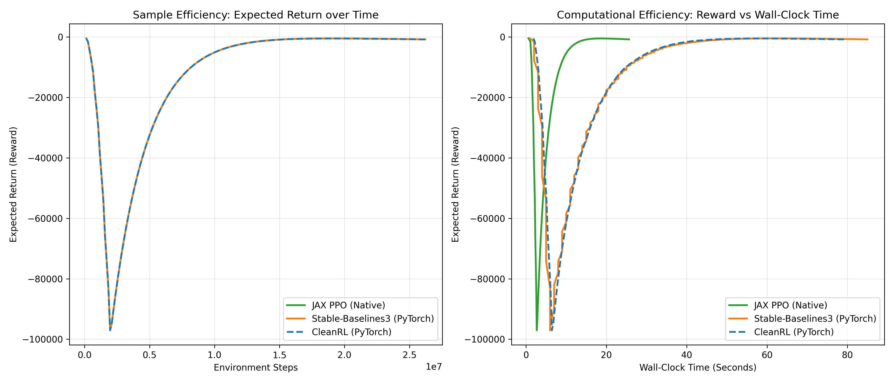
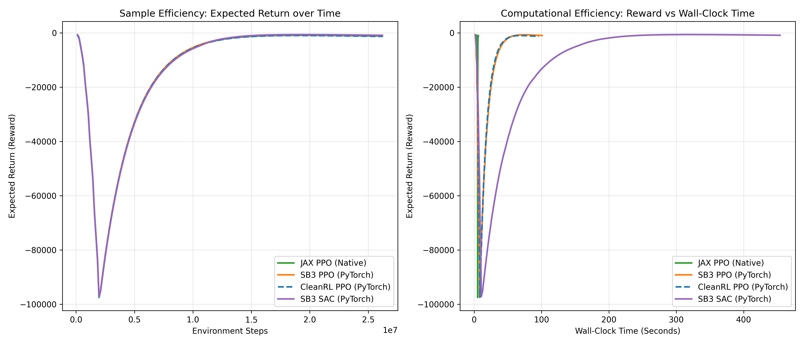

# EnergySim JAX RL Suite (PPO & SAC)

A custom, high-performance Reinforcement Learning suite implemented in pure JAX and Equinox, designed to control building energy simulations (PhyLFlex project) at massive scale. 

Initially built around Proximal Policy Optimization (PPO), this repository has been expanded to include a native Continuous Soft Actor-Critic (SAC) implementation and a robust benchmarking suite comparing JAX-native performance against industry-standard PyTorch frameworks (CleanRL and Stable-Baselines3).

This repository features a fully compiled, vector-parallel architecture (Anakin style) that leverages `@eqx.filter_jit` and `jax.vmap` to run thousands of environment steps per second on CPU/GPU.

## 📂 Project Architecture

To keep the reinforcement learning logic transparent and modular, the project is split into algorithmic components and benchmarking wrappers:

**PPO Engine (On-Policy)**
* **`networks.py`**: Defines the Actor-Critic neural network architecture using Equinox.
* **`rollout.py`**: Handles JAX-compiled environment interactions (`jax.lax.scan`) and memory collection.
* **`loss.py`**: Contains the mathematics for Generalized Advantage Estimation (GAE) and the PPO Clipped Surrogate Objective.
* **`train.py`**: The main execution engine for PPO. 

**SAC Engine (Off-Policy)**
* **`sac_networks.py`**: Defines the Squashed Gaussian Actor and Twin-Q networks.
* **`sac_buffer.py`**: A JAX-optimized `VectorReplayBuffer` utilizing `jax.lax.dynamic_update_slice` for ultra-fast memory allocation.
* **`train_sac_jax.py`**: The execution engine for SAC, handling Polyak averaging and automatic entropy tuning.

**Benchmarking Suite**
* **`benchmark_cleanrl.py` / `benchmark_sb3.py`**: PyTorch baselines using Gymnasium wrappers.
* **`run_suite.py`**: Master script to execute all algorithms sequentially.
* **`plot_benchmark.py`**: Generates smoothed, publication-ready sample and computational efficiency plots.

## 🧠 Technical Notes & JAX Idioms

Building reinforcement learning algorithms in pure JAX requires specific architectural patterns to satisfy the compiler's strict linear algebra and memory rules:

* **The Tensor Hierarchy:** Memory buffers and trajectories are strictly structured as 2D matrices of shape `(Time, Environments)`. 
* **Nested Vectorization:** To evaluate a batch of historical memories `(Time, Env, Features)` through the policy network, we utilize nested vectorization (`jax.vmap(jax.vmap(policy))`). This beautifully maps over the Time dimension, and then over the Environment dimension simultaneously.
* **Pre-allocated Buffers:** Unlike PyTorch lists, the SAC `VectorReplayBuffer` allocates maximum memory upfront and strictly enforces `dtype` matching (e.g., casting boolean `done` flags to `float32` before insertion) to remain JIT-compatible.
* **Equinox PyTrees & Polyak Averaging:** When performing soft updates for Target Q-Networks, the `jax.tree_util.tree_map` function is wrapped with an `eqx.is_array` filter to update network weights while safely ignoring static functions (like `jax.nn.relu` and its `custom_jvp`).

## 🚀 Getting Started

### 1. Clone the Repository
```bash
git clone [https://github.com/](https://github.com/)[YOUR_USERNAME]/energysim-jax-ppo.git
cd energysim-jax-ppo
```

### 2. Set Up the Virtual Environment

It is highly recommended to run this project inside an isolated Python virtual environment.

```bash
python3 -m venv venv
source venv/bin/activate
```

### 3. Install Dependencies

This project uses a requirements.txt file which installs core machine learning libraries (JAX, Equinox, Optax, PyTorch, Stable-Baselines3).

```bash
pip install -r requirements.txt
```

### 4. Add the Data File

Because EnergySim does not package its example data sets during installation, you must manually place the sample_data.csv file into the root directory of this project before running.

## 🏃 Running the Engines

Once your environment is active and the data file is in place, you can run individual training algorithms:

Run Native JAX PPO:
```bash
python train.py
```

Run Native JAX SAC:
```bash
python train_sac_jax.py
```

Run the Full Benchmark Suite:
This will sequentially train the JAX models, followed by the PyTorch (CleanRL/SB3) models, and automatically generate a comparison plot (benchmark_results_smoothed.png).

```bash
python run_suite.py
```

## 📊 Performance Benchmarks

This repository includes an automated benchmarking suite to compare the native JAX implementations against industry-standard PyTorch libraries (Stable-Baselines3 and CleanRL). 

Running `python run_suite.py` generates the following performance comparisons, highlighting two critical dimensions of Reinforcement Learning in thermodynamic environments:

1. **Sample Efficiency (Expected Return vs. Steps):** Demonstrates how quickly the agents learn the building physics. Notice the stability of On-Policy PPO compared to the early-exploration Q-value overestimation typical of Off-Policy SAC.
2. **Computational Efficiency (Expected Return vs. Wall-Clock Time):** Showcases the massive speedup achieved by leveraging JAX's `vmap` and `@eqx.filter_jit`. The fully compiled "Anakin-style" architecture simulates thousands of environments in a fraction of the time required by standard Python multiprocessing.



*Figure 1: Benchmark results generated over 200 epochs simulating 2,048 parallel building environments. JAX Native PPO is run on CPU,*



*Figure 2: Benchmark results generated over 200 epochs simulating 2,048 parallel building environments. JAX Native PPO is run on GPU, and SAC (also in JAX) is added for comparison,*